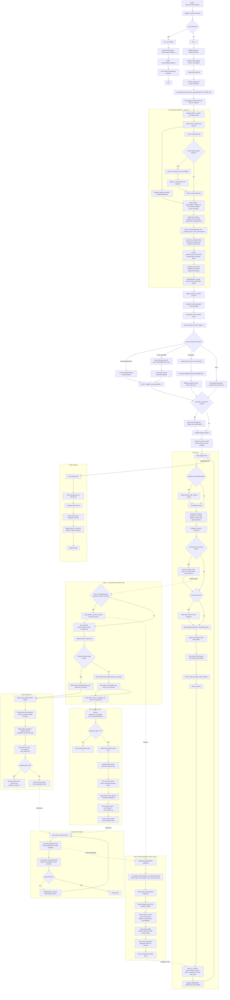

# Thick Lens Focus Lab Procedural Flow

This diagram follows `thick_lens_focus_lab.py` from module launch through the
live ray-tracing/render loop.

```mermaid
flowchart TD
    A["python thick_lens_focus_lab.py"] --> B["argparse: read CLI options"]
    B --> C{"--uv-smoke-exit?"}
    C -- yes --> C1["run_uv_smoke()"]
    C1 --> C2["Build SceneConfig + FreeFrequencySidecar"]
    C2 --> C3["Build ForwardCppLensBench"]
    C3 --> C4["Run small trace/readback iterations"]
    C4 --> C5["Exit"]

    C -- no --> D["run(...)"]
    D --> E["Initialize pygame + OpenGL window"]
    E --> F["Capture WGL display context on Windows"]
    F --> G["Create SceneConfig"]
    G --> H["Set view aspect and sensor resolution"]
    H --> I["FreeFrequencySidecar.lazy_prepare(DEFAULT_FREQ_HZ)"]
    I --> J["ForwardCppLensBench(scene, freq_hz, sidecar)"]

    subgraph BenchInit["ForwardCppLensBench.__post_init__"]
        J1["Initialize BDPT, UV, field, and display state"]
        J2["_build_scene_mesh(scene, sidecar)"]
        J3["_scene_lenses(scene)"]
        J4{"scene.optical_design present?"}
        J5["solve_four_group_zoom_surrogate()"]
        J6["apply_to_scene(); place iris aperture"]
        J7["Return LensConfig stack"]
        J8["Register spectral materials in MaterialDatabase"]
        J9["Build emitters, object/stage, ring light, iris, lens meshes, baffles, sensor enclosure"]
        J10["Orient lens patches; compute verts, normals, material ids, triangle groups"]
        J11["Build LensAssemblySpec from _compound_lens_from_scene(scene)"]
        J12["sync_from_scene(); derive backward ray target and physical camera body"]
        J13["Create _spectral_kernels.RayTracer with geometry, materials, bands"]
        J14["Configure sensor film pipeline and optional regular field capture"]
        J15["Build/register UV page bank and lens parametric groups"]

        J1 --> J2 --> J8 --> J9 --> J10 --> J11 --> J12 --> J13 --> J14 --> J15
        J2 --> J3 --> J4
        J4 -- yes --> J5 --> J6 --> J7
        J4 -- no --> J7
        J7 --> J9
    end

    J --> J1
    J15 --> K["Attach shared GL context to tracer"]
    K --> L["Upload UV blit wavelength-to-RGB weights"]
    L --> M["Apply gains and compute mode"]
    M --> N["tracer.configure_sensor_image(...)"]

    N --> O{"neural / parametric options?"}
    O -- neural payload input --> O1["Load forward/backward neural payloads"]
    O1 --> O2["bench._register_neural_payload(...)"]
    O -- neural assembly --> O3["Bake training rays with trace_forward(blocking=True)"]
    O3 --> O4["Train/export neural assembly payload"]
    O4 --> O2
    O -- parametric --> O5["_compound_lens_from_scene(scene)"]
    O5 --> O6["LensAssemblySpec.MODE_PARAMETRIC"]
    O6 --> O7["Register parametric lens faces with tracer"]
    O -- none --> P["Use default parametric assembly from bench init"]
    O2 --> Q
    O7 --> Q
    P --> Q

    Q{"compute_mode gpu or mixed?"}
    Q -- yes --> Q1["tracer.ensure_pipeline(..., shader_dir=csrc/shaders)"]
    Q -- no --> R["Compile display shaders"]
    Q1 --> R

    R --> S["Create GL textures, VBO state, executor, frame variables"]
    S --> T["Main pygame loop"]

    subgraph FrameLoop["Per frame"]
        T1{"Startup iris rebuild pending?"}
        T2["_rebuild_bench_with_iris(f/22 radius)"]
        T3["Poll pygame events"]
        T4["Handle keys: pause, projection, UV mode, aperture rebuild, lens selection/motion"]
        T5["Update fly-camera movement"]
        T6{"not paused and no trace future?"}
        T7["executor.submit(_trace, rays_per_emitter, seed, max_bounces)"]
        T8{"trace future done?"}
        T9["Read trace result or print exception"]
        T10["bench.display_pipeline_records(field_gain)"]
        T11["upload_volume(tex_field, field_texels)"]
        T12["Set renderer field texture and surface point buffers"]
        T13["bench._poll_assembly_mode_switch()"]
        T14["Clear GL frame"]
        T15["draw_uv_mesh(); draw_surface_points(); draw_acceptance_cones(); draw_pip()"]
        T16["pygame.display.flip(); profiler tick; clock.tick(60)"]

        T1 -- yes --> T2 --> T3
        T1 -- no --> T3
        T3 --> T4 --> T5 --> T6
        T6 -- yes --> T7 --> T8
        T6 -- no --> T8
        T8 -- yes --> T9 --> T10
        T8 -- no --> T10
        T10 --> T11 --> T12 --> T13 --> T14 --> T15 --> T16 --> T
    end

    T --> T1

    subgraph TracePath["_trace(...) submitted by the frame loop"]
        U1{"Async forward/backward endpoints already retained?"}
        U2["_fire_pipeline_camera_render() in daemon thread"]
        U3["Back off while tracer.in_flight_count() exceeds cap"]
        U4["Acquire bench._trace_lock"]
        U5{"Forward warmup target unmet?"}
        U6["bench.trace_forward(warmup_rpe, seed, max_bounces)"]
        U7["bench.bdpt_load_balance(rays_per_emitter)"]
        U8["bench.trace_forward(fwd_rpe, seed, max_bounces)"]
        U9["bench.trace_sensor_cast(bwd_rpe, seed, max_bounces)"]

        U1 -- yes --> U2 --> U3
        U1 -- no --> U3
        U3 --> U4 --> U5
        U5 -- yes --> U6
        U5 -- no --> U7 --> U8 --> U9
    end

    T7 -. worker thread .-> U1

    subgraph ForwardTrace["trace_forward(...)"]
        V1["solve_wave_tubes() unless baking"]
        V2["Sample cosine-hemisphere rays from emitter triangle centroids"]
        V3["Build origins, directions, complex spectral amplitudes, source ids, tags"]
        V4["tracer.submit_rays(..., color_flags=0, max_children=2)"]
        V5{"blocking bake call?"}
        V6["Synchronously drain records until in_flight_count()==0"]
        V7["_ensure_drain_loop(); return submitted count"]

        V1 --> V2 --> V3 --> V4 --> V5
        V5 -- yes --> V6
        V5 -- no --> V7
    end

    U6 --> V1
    U8 --> V1

    subgraph SensorCast["trace_sensor_cast(...)"]
        W1["Refresh backward_ray_target() from LensAssemblySpec"]
        W2{"aperture_radius > 0?"}
        W3["Build circular sensor pixel grid"]
        W4["Sample bokeh stencil points on aperture disk"]
        W5["Aim rays from sensor pixels to sampled aperture points"]
        W6["Apply RGB sensor spectral sensitivity amplitudes"]
        W7["tracer.submit_rays(..., color_flags=1, max_children=1)"]
        W8["_ensure_drain_loop(); return launched count"]

        W1 --> W2
        W2 -- no --> W9["Record skip reason; return 0"]
        W2 -- yes --> W3 --> W4 --> W5 --> W6 --> W7 --> W8
    end

    U9 --> W1

    subgraph DrainLoop["pipeline-drain thread"]
        X1["tracer.drain_records_slim(...)"]
        X2["_fast_bdpt_feed(records): keep forward/sensor strike endpoints"]
        X3["_accumulate_records(records): update hit ring buffer, tri flux, previews"]
        X4{"stop event set?"}
        X5["Sleep/backoff; continue while pipeline active"]

        X1 --> X2 --> X3 --> X4
        X4 -- no --> X5 --> X1
        X4 -- yes --> X6["Thread exits"]
    end

    V7 -. starts/uses .-> X1
    W8 -. starts/uses .-> X1

    subgraph PipelineCamera["trace_forward_backward_sensor_rgb(...)"]
        Y1["Snapshot retained BDPT endpoints"]
        Y2["_run_pipeline_bdpt_shadow_connections(records, pixels, seed, max_shadow_rays, sensor_grid_res)"]
        Y3["Pair forward and backward endpoints"]
        Y4["Submit shadow rays to test endpoint visibility"]
        Y5["Drain shadow records while rerouting non-shadow records back to accumulators"]
        Y6["Accumulate visible endpoint pairs into RGB sensor image"]
        Y7["Also connect backward endpoints directly to emitters"]
        Y8["Tone-map and cache plate RGB"]

        Y1 --> Y2 --> Y3 --> Y4 --> Y5 --> Y6 --> Y7 --> Y8
    end

    U2 -. daemon .-> Y1
    X2 -. retained endpoints .-> Y1
    Y8 -. displayed in PIP .-> T15

    subgraph Shutdown["finally cleanup"]
        Z1["Set closing event"]
        Z2["Stop progressive lens refinement"]
        Z3["Stop/join drain thread"]
        Z4["Cancel trace future; shutdown executor"]
        Z5["Delete bench, GL textures, buffers, shader programs"]
        Z6["pygame.quit()"]
        Z1 --> Z2 --> Z3 --> Z4 --> Z5 --> Z6
    end

    T -- quit/escape/error --> Z1
```
