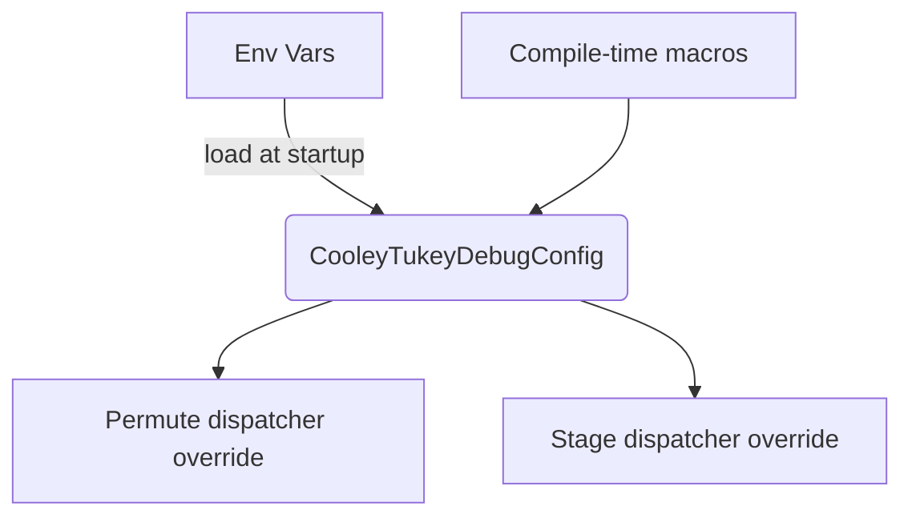

# Cooley–Tukey Debug Compile-Time Options

This document describes the compile-time switches that control Cooley–Tukey
(CoT) debug instrumentation and inlining behaviour inside `eigen_fft.hpp`. The
options are designed for agent-driven analysis of multi-threaded behaviour and
should **never** be turned on in production builds.

> **Scope** — All symbols are read at compile time via `#ifndef` guards **and**
> at runtime via environment variables. The runtime configuration is cached the
> first time any CoT plan executes, so environment variables must be set before
> the process loads FFT code.

---

## Summary Table

| Symbol / Env Var | Type | Default | Effect |
|------------------|------|---------|--------|
| `FFTFREE_CT_FORCE_INLINE_PERMUTE` env: `FFTFREE_CT_INLINE_PERMUTE` | bool | `OFF` (0) | Forces the initial bit-reversal permute pass to run inline on the caller thread. Disables dispatcher parallelism for permute chunks. |
| `FFTFREE_CT_FORCE_INLINE_ALL_STAGES` env: `FFTFREE_CT_INLINE_ALL_STAGES` | bool | `OFF` (0) | Forces **every** Cooley–Tukey butterfly stage to execute inline. If `preserve_outer_dispatch` is false, this collapses the outer worker pool. |
| `FFTFREE_CT_FORCE_INLINE_STAGE` env: `FFTFREE_CT_INLINE_STAGE` | integer (`>=0`) or token list | `-1` (disabled) | Forces a single stage index to execute inline. Runtime env may provide comma-/semicolon-separated list or keywords (`all`,`*`) to mirror `FFTFREE_CT_FORCE_INLINE_ALL_STAGES`. |
| `FFTFREE_CT_FORCE_INLINE_KEEP_DISPATCH` env: `FFTFREE_CT_INLINE_KEEP_DISPATCH` | bool | `ON` (1) | When `ON`, stage/permute inlining **does not** replace the dispatcher; outer batch parallelism stays intact. When `OFF`, inlining swaps in the `InlineDispatcher`, collapsing the outer worker pool. |

---

## Interaction Model

The Cooley–Tukey executor queries a `CooleyTukeyDebugConfig` before each plan
runs. The config is populated by:

1. Runtime environment variables (string flags take precedence).
2. Compile-time macros (`FFTFREE_CT_FORCE_INLINE_*`).

The config is cached statically, so the first plan invocation fixes the
behaviour for the remainder of the process. Re-run your application after
changing environment variables.

---

## Detailed Behaviour

### `FFTFREE_CT_FORCE_INLINE_PERMUTE`

- **Compile time**: define the macro or pass `-DFFTFREE_CT_FORCE_INLINE_PERMUTE=ON`.
- **Runtime**: set environment variable `FFTFREE_CT_INLINE_PERMUTE` to any truthy value (`1`, `true`, `yes`, etc.).
- When enabled, permute chunks ignore the plan dispatcher unless
  `FFTFREE_CT_FORCE_INLINE_KEEP_DISPATCH` is true.
- Use this to isolate the cost/contention of the bit-reversal pass without
  muting stage-level parallelism.

### `FFTFREE_CT_FORCE_INLINE_ALL_STAGES`

- **Compile time**: `-DFFTFREE_CT_FORCE_INLINE_ALL_STAGES=ON`.
- **Runtime**: set `FFTFREE_CT_INLINE_ALL_STAGES` to a truthy value, or set
  `FFTFREE_CT_INLINE_STAGE` to `all`, `*`, or `true`.
- Each butterfly stage runs on the caller thread. If dispatcher preservation is
  disabled, this removes all outer threading. Leave `KEEP_DISPATCH=ON` to keep
  batch splits while forcing only the inner stage loop inline.

### `FFTFREE_CT_FORCE_INLINE_STAGE`

- **Compile time**: `-DFFTFREE_CT_FORCE_INLINE_STAGE=<index>` (single stage).
- **Runtime**: `FFTFREE_CT_INLINE_STAGE=<indices>` where `<indices>` is:
  - A single integer (e.g., `3`).
  - A comma/semicolon/colon separated list (`0,2,5`).
  - One of the keywords `all`, `*`, `true` to match `FFTFREE_CT_FORCE_INLINE_ALL_STAGES`.

When multiple indices are specified at runtime the compile-time `STAGE` macro
is ignored. Stage-level overrides respect the dispatcher preservation flag.

### `FFTFREE_CT_FORCE_INLINE_KEEP_DISPATCH`

- **Compile time**: `-DFFTFREE_CT_FORCE_INLINE_KEEP_DISPATCH=OFF` disables
  preservation globally.
- **Runtime**: set `FFTFREE_CT_INLINE_KEEP_DISPATCH` to `0`, `false`, `off` to
  disable preservation.

When `ON`, the permute/stage overrides **do not** install the inline dispatcher;
they simply run their work inline on the worker thread that dequeued the chunk.
This keeps the outer worker pool active even under heavy debug instrumentation.

When `OFF`, forcing inline replaces the dispatcher with `InlineDispatcher`,
collapsing outer pool fan-out. This mirrors legacy behaviour prior to the
preservation guard.

---

## Recommended Presets

| Scenario | `FFTFREE_CT_FORCE_INLINE_PERMUTE` | `FFTFREE_CT_FORCE_INLINE_ALL_STAGES` | `FFTFREE_CT_FORCE_INLINE_STAGE` | `FFTFREE_CT_FORCE_INLINE_KEEP_DISPATCH` |
|----------|------------------------------------|--------------------------------------|---------------------------------|------------------------------------------|
| **Full inline (legacy)** | `ON` | `ON` | `0` (startup stage) | `OFF` |
| **Outer threads preserved (current default)** | `ON` | `ON` | `0` | `ON` |
| **Permute inline only** | `ON` | `OFF` | `-1` | `ON` |
| **Specific stage inline** | `OFF` | `OFF` | set to index | `ON` |

Use `tools/ct_debug_preset.py` to print the correct `cmake` command for each
preset.

---

## Environment Variable Reference

| Variable | Accepted Values | Notes |
|----------|-----------------|-------|
| `FFTFREE_CT_INLINE_PERMUTE` | empty / `0`,`false`,`off` / any other | Truthy values enable permute inlining.
| `FFTFREE_CT_INLINE_ALL_STAGES` | same as above | Overrides stage list to all stages.
| `FFTFREE_CT_INLINE_STAGE` | integer list, `all`, `*`, `true`, `on` | Parsed once at process startup.
| `FFTFREE_CT_INLINE_KEEP_DISPATCH` | `1`,`true`,`on` (preserve) / `0`,`false`,`off` (collapse) | Controls dispatcher substitution.

Whitespace is ignored; parsing is case-insensitive.

---

## Troubleshooting

- **Outer threading stopped working**: confirm `FFTFREE_CT_FORCE_INLINE_KEEP_DISPATCH` is `ON` (or env var truthy). If a build was configured with `KEEP_DISPATCH=OFF`, you must re-run CMake to change it.
- **Runtime stages list ignored**: ensure no compile-time `FFTFREE_CT_FORCE_INLINE_ALL_STAGES` or single-stage define is in place. The runtime list only augments the config if the compile-time macro is unset or `-1`.
- **Environment change not applied**: restart the process; the config is cached in static storage.
- **Need mixed stage list at compile time**: not supported. Use runtime env (`FFTFREE_CT_INLINE_STAGE="0,2,5"`) instead.

---

## Best Practices for Agents

1. **Always reconfigure** using CMake cache options rather than editing headers directly.
2. **Automate with wrappers** (`ct_debug_preset.py`) to keep build commands reproducible.
3. **Record the preset** alongside any profiling results; the CoT behaviour is extremely sensitive to these flags.
4. **Reset environment** between runs to avoid sticky configuration when switching tests.

---

For questions or deeper instrumentation requirements, consult `eigen_fft.hpp`
(`CooleyTukeyDebugConfig`) and `WorkerPool` dispatch code paths.
